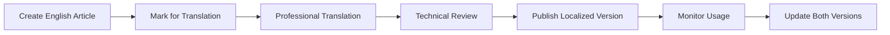

# Help Center Creation Skill

## Description
Design and build a comprehensive self-service help center that empowers users to find answers quickly, reduces support burden, and improves customer satisfaction. A well-structured help center is often the first line of support and a critical component of customer success.

## When to Use
- Scaling support beyond team capacity
- High volume of repetitive questions
- Improving customer self-service adoption
- Reducing time to resolution
- Supporting global customers across time zones
- Decreasing cost per support interaction

## Help Center Components

### Essential Elements
1. **Knowledge Base Articles** - Detailed how-to guides
2. **FAQs** - Quick answers to common questions
3. **Video Tutorials** - Visual learning content
4. **Getting Started Guides** - Onboarding content
5. **Troubleshooting** - Self-service problem solving
6. **Release Notes** - Product updates
7. **Contact Options** - When self-service isn't enough
8. **Search Functionality** - Fast answer discovery

## Planning Framework

### 1. Define Help Center Strategy
```markdown
## Help Center Strategy Template

### Business Objectives
- **Primary Goal:** [e.g., Reduce support tickets by 30%]
- **Secondary Goals:**
  - [Improve CSAT scores]
  - [Decrease time to resolution]
  - [Enable 24/7 support]

### Target Audience
**Primary Users:**
- **Segment 1:** [End users - Role, technical level]
- **Segment 2:** [Admins - Role, needs]
- **Segment 3:** [Developers - Technical needs]

**User Needs Analysis:**
| Segment | Top Questions | Preferred Format | Urgency Level |
|---------|--------------|------------------|---------------|
| End Users | How do I...? | Short articles, videos | Medium |
| Admins | Configuration, settings | Detailed guides | High |
| Developers | API, integrations | Code examples, reference | High |

### Success Metrics
- **Adoption:** % users visiting help center before contacting support
- **Deflection:** % questions resolved without ticket
- **Satisfaction:** Help center article ratings
- **Engagement:** Time on page, pages per session
- **Search Success:** % searches resulting in article click

### Resource Requirements
- Content writers: [Number, allocation]
- Video producers: [If creating videos]
- Platform cost: [Monthly/annual budget]
- Maintenance hours: [Weekly time commitment]
```

### 2. Content Inventory & Gap Analysis
```markdown
## Content Audit Template

### Existing Content
| Topic | Current State | Format | Quality Score | Update Needed |
|-------|---------------|--------|---------------|---------------|
| Getting Started | Published | Article | 8/10 | No |
| Account Setup | Missing | - | - | Create |
| Feature X | Outdated | Article | 4/10 | Rewrite |
| API Docs | Published | Reference | 9/10 | No |

### Top Support Tickets (Gap Analysis)
1. **Topic:** [Password reset]
   - **Volume:** 150/month
   - **Content Status:** Missing
   - **Priority:** High

2. **Topic:** [Integration setup]
   - **Volume:** 100/month
   - **Content Status:** Incomplete
   - **Priority:** High

3. **Topic:** [Export data]
   - **Volume:** 75/month
   - **Content Status:** Outdated
   - **Priority:** Medium

### Content Creation Roadmap
**Month 1:**
- [ ] [High-priority article 1]
- [ ] [High-priority article 2]
- [ ] [Quick start guide]

**Month 2:**
- [ ] [Video tutorial 1]
- [ ] [Medium-priority articles]
- [ ] [FAQ compilation]

**Month 3:**
- [ ] [Advanced guides]
- [ ] [Troubleshooting section]
- [ ] [Developer docs]
```

## Information Architecture

### Category Structure
```markdown
## Help Center Taxonomy

### Primary Categories
1. **Getting Started** (Onboarding)
   - Quick Start Guide
   - Account Setup
   - First Steps
   - Basic Concepts

2. **Using [Product Name]** (Core Features)
   - Feature Category 1
     - Overview
     - How-to Guides
     - Best Practices
   - Feature Category 2
   - Feature Category 3

3. **Account & Billing** (Admin)
   - Account Settings
   - User Management
   - Subscription & Billing
   - Security

4. **Integrations** (Technical)
   - Available Integrations
   - Setup Guides
   - API Reference
   - Webhooks

5. **Troubleshooting** (Support)
   - Common Issues
   - Error Messages
   - Performance
   - Known Limitations

6. **Product Updates** (Communication)
   - Release Notes
   - Changelog
   - Upcoming Features

### Navigation Best Practices
- Maximum 7 top-level categories
- Maximum 3 levels deep
- Group by user intent, not product structure
- Use clear, user-friendly labels
- Provide multiple navigation paths
```

### Search Optimization
```markdown
## Search Strategy

### Article SEO
**Title Optimization:**
- Start with action verbs ("How to...", "Fix...", "Set up...")
- Include key terms users search for
- Keep under 60 characters
- Match user language, not internal jargon

**Content Optimization:**
- Include variations of key terms
- Use synonyms naturally
- Front-load important information
- Answer the question in first paragraph
- Use headers for scanability

### Search Features
- [ ] Auto-suggest as user types
- [ ] "Did you mean?" spelling correction
- [ ] Related articles suggestions
- [ ] Recent searches
- [ ] Popular articles
- [ ] Filter by category
- [ ] Sort by relevance/date

### Failed Search Handling
```javascript
// Track failed searches for content gaps
if (searchResults.length === 0) {
  logFailedSearch({
    query: searchTerm,
    timestamp: Date.now(),
    userId: currentUser.id
  });

  // Provide alternatives
  showSuggestions([
    'Browse all articles',
    'Contact support',
    'Related topics: [similar category]'
  ]);
}
```
```

## Article Template Library

### How-To Article Template
```markdown
# How to [Accomplish Specific Task]

**Time to complete:** [X minutes]
**Difficulty:** [Beginner/Intermediate/Advanced]

## What you'll need
- [Requirement 1]
- [Requirement 2]
- [Permission level needed]

## Overview
[Brief description of what this task accomplishes and why it's useful]

## Step-by-step instructions

### Step 1: [First Action]
1. Navigate to [location]
2. Click [specific button]
3. You should see [expected outcome]


💡 **Tip:** [Helpful context or shortcut]

### Step 2: [Configure Settings]
[Detailed instructions with visuals]

⚠️ **Important:** [Critical information or warning]

### Step 3: [Verify & Complete]
To confirm it's working:
- [ ] [Check 1]
- [ ] [Check 2]

## Troubleshooting
**Problem:** [Common issue]
**Solution:** [How to fix]

## What's next?
- [Related task or feature to explore]
- [Link to advanced guide]

## Related articles
- [Related article 1]
- [Related article 2]

---
**Was this article helpful?** [Yes] [No]
**Last updated:** January 26, 2025
```

### Troubleshooting Article Template
```markdown
# Fixing [Specific Problem/Error]

## Symptoms
You may experience this issue if:
- [Symptom 1]
- [Symptom 2]
- Error message: "[Exact error text]"

## Common causes
- [Cause 1]: [Brief explanation]
- [Cause 2]: [Brief explanation]
- [Cause 3]: [Brief explanation]

## Solution 1: [Most Common Fix]

**This works for:** [Specific scenario]

**Steps:**
1. [Action 1]
2. [Action 2]
3. [Verification step]

**Result:** [What should happen]

## Solution 2: [Alternative Fix]

**Try this if:** [Conditions for this solution]

**Steps:**
[Detailed instructions]

## Still not working?

### Advanced troubleshooting
1. [More technical step 1]
2. [More technical step 2]

### Contact support
If you've tried all solutions above:
- Include error screenshots
- Note when issue started
- Describe what you were doing
- [Contact support button]

## Preventing this issue
- ✅ [Best practice 1]
- ✅ [Best practice 2]

---
**Did this solve your problem?** [Yes] [No]
```

### FAQ Article Template
```markdown
# Frequently Asked Questions: [Topic]

## [Category 1 Name]

### [Question 1]?
[Clear, concise answer with link to detailed article if needed]
[Read more: Link to full guide]

### [Question 2]?
[Answer]

### [Question 3]?
[Answer]

## [Category 2 Name]

### [Question 4]?
[Answer]

---

## Didn't find what you need?
- [Search all articles]
- [Browse categories]
- [Contact support]
```

## Visual Content Guidelines

### Screenshot Standards
```markdown
## Screenshot Creation Checklist

### Before Capturing
- [ ] Use production environment
- [ ] Clear test data
- [ ] Use realistic examples
- [ ] Standard browser size (1280x720)
- [ ] Hide personal information
- [ ] Use default theme/settings

### Annotation Best Practices
- **Arrows:** Point to action targets
- **Numbers:** Show sequence (1, 2, 3)
- **Highlights:** Circle or box important elements
- **Callouts:** Brief text explanations
- **Colors:** Consistent across help center
  - Red: Important warnings
  - Blue: Information highlights
  - Green: Success states
  - Orange: Attention needed

### Technical Specs
- Format: PNG for UI, JPG for photos
- Max width: 800px (responsive)
- Compression: 70-80% quality
- Alt text: Descriptive for accessibility
- File naming: feature-action-step.png

### Update Triggers
- UI redesign
- Feature changes
- Branding updates
- Every 6 months (review)
```

### Video Tutorial Guidelines
```markdown
## Video Production Standards

### Planning
**Script Template:**
```
[0:00-0:05] Introduction
"In this video, you'll learn how to [outcome]"

[0:05-0:30] Context
"This is useful when you need to [use case]"

[0:30-2:00] Step-by-step
"First, [step 1]..."
"Next, [step 2]..."
"Finally, [step 3]..."

[2:00-2:15] Wrap-up
"You've successfully [accomplished task]"
"For more help, check out [related resource]"
```

### Recording Specs
- **Length:** 1-3 minutes ideal
- **Resolution:** 1080p minimum
- **Frame rate:** 30fps
- **Audio:** Clear voiceover or captions
- **Branding:** Intro/outro cards (optional)

### Accessibility
- [ ] Captions/subtitles
- [ ] Transcript below video
- [ ] Audio description (if complex visuals)
- [ ] Chapter markers for long videos

### Hosting
- Embed on help center page
- YouTube/Vimeo for discoverability
- Thumbnail with play button
- Video description with key steps
```

## Help Center Platforms

### Platform Comparison
```markdown
## Tool Selection Matrix

### Standalone Help Centers
**Zendesk Guide**
- Pros: Powerful, integrated ticketing, AI search
- Cons: Expensive, setup complexity
- Best for: Enterprise, high-volume support

**Intercom Articles**
- Pros: In-app integration, messenger connection
- Cons: Limited customization, costly
- Best for: SaaS with in-app support focus

**HelpScout Docs**
- Pros: Clean, affordable, good search
- Cons: Fewer advanced features
- Best for: Small to mid-size teams

**Notion**
- Pros: Flexible, collaborative, affordable
- Cons: Not purpose-built for support
- Best for: Startups, internal knowledge bases

### Custom Solutions
**Docusaurus/GitBook**
- Pros: Version control, developer-friendly, free
- Cons: Technical setup, self-hosted
- Best for: Developer docs, open source

### Selection Criteria
1. Integration with support tools
2. Search quality and AI
3. Analytics and reporting
4. Customization options
5. Multi-language support
6. Cost and scalability
7. Ease of content management
```

## Launch Checklist

### Pre-Launch
```markdown
## Help Center Launch Preparation

### Content Readiness
- [ ] Top 20 support questions covered
- [ ] Getting started guide complete
- [ ] At least 3 articles per main category
- [ ] All links tested and working
- [ ] Images optimized and loading
- [ ] Videos embedded and playing
- [ ] Search index built

### Design & UX
- [ ] Mobile-responsive design verified
- [ ] Navigation intuitive (user tested)
- [ ] Branding consistent with product
- [ ] Contact support clearly visible
- [ ] Loading speed < 3 seconds
- [ ] Accessibility standards met (WCAG 2.1)

### Technical Setup
- [ ] Custom domain configured (help.company.com)
- [ ] SSL certificate active
- [ ] Analytics tracking implemented
- [ ] Search functionality tested
- [ ] Feedback widgets installed
- [ ] SEO meta tags configured

### Process & Team
- [ ] Content review workflow defined
- [ ] Update schedule established
- [ ] Team trained on platform
- [ ] Support team aware of launch
- [ ] Escalation paths documented
```

### Launch Communications
```markdown
## Announcement Strategy

### Internal Launch (Week before public)
**To:** Support team
**Message:** "New help center launching. Here's how to use it with customers..."

**To:** All employees
**Message:** "Our new help center is here! Share with customers: [URL]"

### Customer Launch
**Email Campaign:**
Subject: "Get Help Faster: Introducing Our New Help Center"

Body:
- Highlight self-service benefits
- Showcase key articles
- Encourage exploration
- Still offer human support

**In-App Announcement:**
- Banner or modal introducing help center
- Link to getting started
- Encourage search

**Blog Post:**
- Why we built it
- What's available
- How to use it
- Future plans
```

## Maintenance & Optimization

### Content Maintenance Schedule
```markdown
## Help Center Maintenance Cadence

### Daily
- [ ] Monitor search analytics
- [ ] Review article feedback
- [ ] Check for broken links
- [ ] Respond to article comments (if enabled)

### Weekly
- [ ] Analyze top support tickets for content gaps
- [ ] Review most/least viewed articles
- [ ] Update time-sensitive content
- [ ] Publish new articles (ongoing)

### Monthly
- [ ] Content audit top 20 articles
- [ ] Update outdated screenshots
- [ ] Review and consolidate duplicate content
- [ ] Analyze search success rate
- [ ] Team retrospective on helpfulness

### Quarterly
- [ ] Major content refresh
- [ ] User feedback survey
- [ ] Competitive analysis
- [ ] Category structure review
- [ ] Platform performance review
- [ ] Archive outdated articles

### Annually
- [ ] Complete content inventory
- [ ] Help center redesign consideration
- [ ] Platform evaluation
- [ ] Comprehensive user research
```

### Analytics Dashboard
```markdown
## Key Metrics to Track

### Usage Metrics
**Overall Traffic:**
- Unique visitors/month
- Page views
- Pages per session
- Average time on site
- Bounce rate
- New vs. returning visitors

**Article Performance:**
```sql
SELECT
  article_title,
  page_views,
  avg_time_on_page,
  helpful_votes,
  not_helpful_votes,
  (helpful_votes * 1.0 / (helpful_votes + not_helpful_votes)) as satisfaction_rate
FROM help_center_analytics
WHERE date >= DATE_SUB(CURRENT_DATE, INTERVAL 30 DAY)
ORDER BY page_views DESC
LIMIT 20;
```

### Search Analytics
- Total searches
- Searches with no results (content gaps!)
- Top search terms
- Search to click-through rate
- Search refinements

### Support Deflection
**Formula:**
```
Deflection Rate = (Help Center Sessions / (Help Center Sessions + Support Tickets)) × 100
```

**Example Report:**
| Metric | This Month | Last Month | Change |
|--------|-----------|------------|---------|
| Help Center Visits | 10,000 | 8,500 | +17.6% |
| Support Tickets | 1,200 | 1,400 | -14.3% |
| Deflection Rate | 89.3% | 85.9% | +3.4% |
| Avg. Time to Resolution | 2.5 min | 3.1 min | -19.4% |

### Content Quality Metrics
- Article helpfulness rating (target: >70% helpful)
- Article completeness score
- Time since last update
- Broken links count
- Missing images count
```

## Advanced Features

### AI-Powered Search
```markdown
## Implementing Smart Search

### Natural Language Processing
- Understand user intent, not just keywords
- Handle typos and misspellings
- Interpret questions ("How do I..." → relevant articles)
- Learn from click behavior

### Example Configuration (Algolia)
```javascript
const searchClient = algoliasearch('APP_ID', 'API_KEY');

const search = instantsearch({
  indexName: 'help_articles',
  searchClient,
  routing: true,
  insights: true
});

// AI-powered relevance
search.addWidgets([
  instantsearch.widgets.configure({
    attributesToSnippet: ['content:50'],
    snippetEllipsisText: '...',
    hitsPerPage: 10,
    typoTolerance: true,
    minWordSizefor1Typo: 4,
    minWordSizefor2Typos: 8,
    // Boost recent, popular content
    customRanking: [
      'desc(helpful_votes)',
      'desc(updated_at)',
      'desc(page_views)'
    ]
  })
]);
```

### Suggested Articles (AI)
```javascript
// Machine learning for article recommendations
function getSuggestedArticles(currentArticle, userContext) {
  // Content-based filtering
  const similarContent = findSimilarByTags(currentArticle.tags);

  // Collaborative filtering
  const readByOthers = getUserBehaviorPatterns(userContext);

  // Hybrid recommendation
  return mergeAndRank(similarContent, readByOthers);
}
```
```

### Chatbot Integration
```markdown
## Help Center Bot Strategy

### When to Use Chatbot
- ✅ Answer simple, factual questions
- ✅ Guide users to right article
- ✅ Collect context before human handoff
- ✅ Handle off-hours inquiries

### When to Escalate to Human
- ❌ User frustrated (negative sentiment)
- ❌ Complex, multi-part questions
- ❌ Account-specific issues
- ❌ Sales or high-value inquiries

### Bot Configuration
```yaml
chatbot:
  greeting: "Hi! I can help you find answers quickly. What do you need help with?"

  intent_matching:
    - intent: "password_reset"
      confidence_threshold: 0.8
      response: "article://password-reset-guide"

    - intent: "billing_question"
      confidence_threshold: 0.7
      response: "Let me connect you with our billing team..."
      action: escalate_to_human

  fallback:
    low_confidence: "I'm not sure I understand. Here are our most popular articles..."
    no_match: "I couldn't find a specific answer. Would you like to chat with our support team?"
```
```

### Multi-Language Support
```markdown
## Localization Strategy

### Language Priority
1. **Analyze user base:**
   - User location data
   - Browser language settings
   - Support ticket languages

2. **Prioritize languages:**
   - Start with top 2-3 languages (80% coverage)
   - Expand based on business growth

### Translation Workflow


### Implementation
- **Language selector:** Prominent, persistent
- **URL structure:** help.company.com/es/article-slug
- **Maintain parity:** Update all languages together
- **RTL support:** For Arabic, Hebrew
- **Localize examples:** Use culturally relevant scenarios
- **Image translation:** Create localized screenshots
```

## Common Pitfalls

1. **Building it and expecting users to come**
   - Solution: Promote actively, link from product, train support to use

2. **Organizing by product structure vs. user needs**
   - Solution: Category names should match user questions

3. **Too much content too soon**
   - Solution: Start small, expand based on usage data

4. **Writing for experts, not beginners**
   - Solution: Assume no prior knowledge, define terms

5. **Letting content get stale**
   - Solution: Regular review schedule, ownership assignments

6. **No feedback mechanism**
   - Solution: "Was this helpful?" on every article

7. **Poor search functionality**
   - Solution: Invest in good search, monitor failed queries

8. **Mobile experience as afterthought**
   - Solution: Design mobile-first

## Tips for Success

### Content Quality
- **Start with top 20 questions** - Maximum impact quickly
- **Use real user language** - Copy from support tickets
- **Show, don't just tell** - Screenshots for every step
- **Test with users** - Watch them try to find answers
- **Iterate based on data** - Analytics show what's working

### Organization
- **Clear hierarchy** - Never more than 3 clicks to content
- **Multiple paths** - Browse, search, suggested articles
- **Related content** - Link articles together
- **Breadcrumbs** - Help users understand location

### Engagement
- **Encourage feedback** - On every article
- **Surface popular content** - "Most viewed" sections
- **Personalize when possible** - Show relevant articles by user role
- **Gamify contributions** - If community-driven

### Measurement
- **Define success upfront** - What does "good" look like?
- **Track leading indicators** - Usage patterns predict outcomes
- **Report to stakeholders** - Share wins and learnings
- **Connect to business metrics** - Support cost, CSAT, retention

## Example Implementation Timeline

```markdown
## 90-Day Help Center Launch Plan

### Month 1: Foundation
**Week 1-2: Planning**
- Define strategy and goals
- Select platform
- Conduct content audit
- Analyze support tickets

**Week 3-4: Setup**
- Configure platform
- Design information architecture
- Create templates
- Write top 10 articles

### Month 2: Content Creation
**Week 5-6: Core Content**
- Write 20 more articles
- Create getting started guide
- Record 3 video tutorials
- Build FAQ sections

**Week 7-8: Optimization**
- Add screenshots to all articles
- Optimize for search
- Internal user testing
- Refine based on feedback

### Month 3: Launch & Iteration
**Week 9: Soft Launch**
- Launch to beta users
- Monitor analytics
- Gather feedback
- Fix issues

**Week 10: Public Launch**
- Announce to all customers
- Promote through all channels
- Train support team
- Monitor closely

**Week 11-12: Optimize**
- Analyze usage data
- Fill content gaps
- Improve low-performing articles
- Establish maintenance routine
```

## Related Skills
- Product Documentation
- Customer Education Programs
- Technical Writing
- Information Architecture
- SEO & Content Optimization
- Customer Support Strategy
